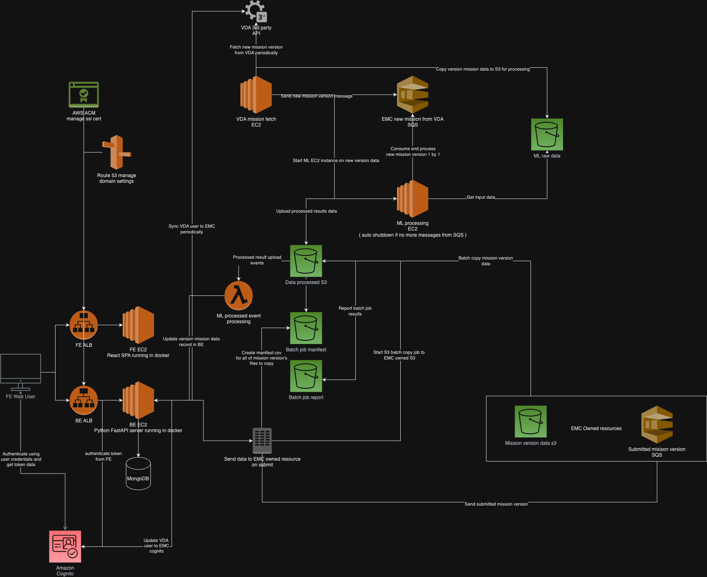

# EMC System



## Required EC2 instances:

---

### Back end instance:

#### Instance ID: i-0a12b02d6e372f5ec

#### Description:

- Back end: provide api for front end and integrate with VDA 3rd party api. API are authenticated by AWS Cognito<br>
  Periodically sync user from VDA to EMC cognito.<br>
  Integrate with score service.<br>
  Core language: Python<br>
  Frameworks: FastAPI<br>
  Interacting services: Secret manager, S3, MongoDB, Cognito<br>

  Source code: https://git-codecommit.us-east-1.amazonaws.com/v1/repos/emc-new-be

Service running using docker and docker compose

AMI: CIS Ubuntu Linux 20.04 LTS Benchmark v1.1.0.8

IAM Role: EMC-Webserver-Dev

#### Inbound access:

| Ports | Protocol | Source          | Purpose        |
| ----- | -------- | --------------- | -------------- |
| 4000  | TCP      | 0.0.0.0/0, ::/0 | BE HTTP access |
| 22    | TCP      | 0.0.0.0/0, ::/0 | SSH            |

#### Outbound access:

| Ports | Protocol | Source          | Purpose |
| ----- | -------- | --------------- | ------- |
| All   | All      | 0.0.0.0/0, ::/0 | Default |

---

### VDA API mission sync instance:

#### Instance ID: i-0a5b3507a84844e9a

#### Description:

Service running periodically fetching missions data from VDA 3rd party API, sync mission data to EMC S3, send SQS message and trigger ML instance.

Core language: Python<br>
Interacting services: S3, VDA API, SQS, EC2<br>

Source code: https://git-codecommit.us-east-1.amazonaws.com/v1/repos/vda-api

Service running using docker and docker compose

AMI: CIS Ubuntu Linux 20.04 LTS Benchmark v1.1.0.8

#### Inbound access:

| Ports | Protocol | Source          | Purpose |
| ----- | -------- | --------------- | ------- |
| 22    | TCP      | 0.0.0.0/0, ::/0 | SSH     |

#### Outbound access:

| Ports | Protocol | Source          | Purpose |
| ----- | -------- | --------------- | ------- |
| All   | All      | 0.0.0.0/0, ::/0 | Default |

---

### ML instance:

#### Instance ID: i-02926e8ae2555d5d4

#### Description:

Start / trigger by other service to check for new mission message from SQS, run through ML workflow and upload processed data to S3

Core language: Python<br>
Interacting services: S3, SQS, EC2<br>

Source code:

- Roof score ML: git@bitbucket.org:deeplanceai/emc-roof-scoring.git
- ML workflow: https://git-codecommit.us-east-1.amazonaws.com/v1/repos/emc-ml-python-script

AMI: CIS Ubuntu Linux 20.04 LTS Benchmark v1.1.0.8

#### Inbound access:

| Ports | Protocol | Source          | Purpose |
| ----- | -------- | --------------- | ------- |
| 22    | TCP      | 0.0.0.0/0, ::/0 | SSH     |

#### Outbound access:

| Ports | Protocol | Source          | Purpose |
| ----- | -------- | --------------- | ------- |
| All   | All      | 0.0.0.0/0, ::/0 | Default |

---

### Front end instance:

#### Instance ID: i-0be25c8b22e804ce4

#### Description:

Front end react app serving

Core language: javascript<br>
Frameworks: React<br>
Interacting services: EMC BE, GoogleMaps<br>

Source code: https://git-codecommit.us-east-1.amazonaws.com/v1/repos/emc-fe

AMI: CIS Ubuntu Linux 20.04 LTS Benchmark v1.1.0.8

#### Inbound access:

| Ports | Protocol | Source          | Purpose |
| ----- | -------- | --------------- | ------- |
| 80    | TCP      | 0.0.0.0/0, ::/0 | HTTP    |
| 22    | TCP      | 0.0.0.0/0, ::/0 | SSH     |

#### Outbound access:

| Ports | Protocol | Source          | Purpose |
| ----- | -------- | --------------- | ------- |
| All   | All      | 0.0.0.0/0, ::/0 | Default |

---

**FE and BE instance sit behind AWS application load balancer which handle domain routing and SSL**

- after EC2 instances are available
- setup ALB for required EC2 following: https://docs.aws.amazon.com/elasticloadbalancing/latest/application/create-application-load-balancer.html#configure-load-balancer
- backend load balancer need to edit idle timeout to 480 seconds since score update calculation might take long

---

## Other AWS services:

---

### EMC Functions:

#### Description:

AWS lambda to read and send ML processed data to score service.
Trigger by S3 notification on ML result uploaded to S3 bucket

Core language: javascript<br>
Interacting services: Score service<br>

Source Code and deployment instruction: https://git-codecommit.us-east-1.amazonaws.com/v1/repos/emc-functions

To setup:

- Create needed lambda function: following https://docs.aws.amazon.com/lambda/latest/dg/getting-started.html#getting-started-create-function
- Setup event trigger from s3 upload following: https://docs.aws.amazon.com/lambda/latest/dg/with-s3-example.html<br>
  needed event filter are in functions repo's readme

---

### EMC Cognito user pool:

#### Description:

Provide authentication, user base for application via Oauth2 with hosted UI and access token. Integrate with FE and BE.<br>
Provide sign in, forgot password, mfa features.<br>
Record authentication event to AWS cloud trail for auditing.

#### Setup:

- start creating user pool: https://docs.aws.amazon.com/cognito/latest/developerguide/tutorial-create-user-pool.html
- configure security requirements ( password min 8 chars ), required MFA ( app auth only since we don't use SMS ), account recovery email option.
- No signup
- Message delivery should be email only, email provider: send with cognito
- Integrate your app, name your user pool, configure the hosted UI, and create an app client.

  - Create app client in app integration for FE:

  ```
  Authentication flows:
  ALLOW_CUSTOM_AUTH
  ALLOW_REFRESH_TOKEN_AUTH
  ALLOW_USER_SRP_AUTH
  ...
  Allowed callback URLs
  http://localhost:3000/login
  http://localhost:8548/login
  https://dev.emcscoring.com/login

  Allowed sign-out URLs
  http://localhost:3000/
  http://localhost:8548/
  https://dev.emcscoring.com/

  Identity providers
  Cognito user pool directory

  OAuth grant types
  Authorization code grant
  Implicit grant

  OpenID Connect scopes
  aws.cognito.signin.user.admin
  email
  openid
  phone
  profile

  Advanced Security:
  Enforcement method
  Audit-only
  ```

- Config app client in FE according to README in FE repo

- Create groups match application user group ( Admin , SuperAdmin, User )

---

### WAF and Shield:

#### Description:

Protect BE and FE load balancer with web ACLs

#### Setup:

**_ Require ALB already set up_**

- Create web ACL follow: https://docs.aws.amazon.com/waf/latest/developerguide/web-acl-creating.html
- Associate with FE and BE ALB aws resource
- Currently only have 1 rules `sqlcheck`:

  ```
  {
    "Name": "sqlcheck",
    "Priority": 0,
    "Statement": {
      "SqliMatchStatement": {
        "FieldToMatch": {
          "QueryString": {}
        },
        "TextTransformations": [
          {
            "Priority": 0,
            "Type": "LOWERCASE"
          },
          {
            "Priority": 1,
            "Type": "URL_DECODE"
          }
        ],
        "SensitivityLevel": "LOW"
      }
    },
    "Action": {
      "Block": {}
    },
    "VisibilityConfig": {
      "SampledRequestsEnabled": true,
      "CloudWatchMetricsEnabled": true,
      "MetricName": "sqlcheck"
    }
  }
  ```

---

### Route 53 and certificate manager:

#### Description:

Handle domain and SSL cert for BE and FE
